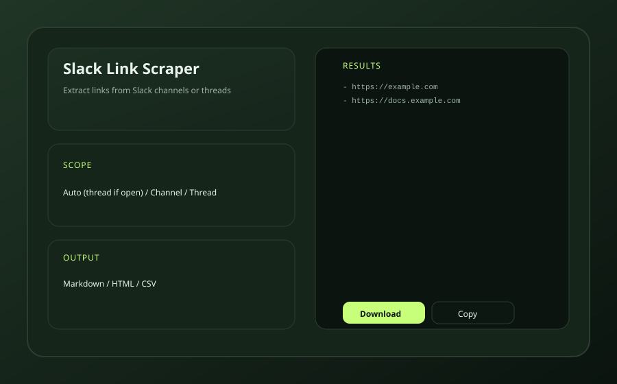

# Slack Link Scraper (Chrome Extension)

Extract links from Slack web channels or threads and export as Markdown, HTML, or CSV.

## Install (Chrome)
1. Open `chrome://extensions`.
2. Enable **Developer mode**.
3. Click **Load unpacked**.
4. Select the folder where you cloned this repo.

## Open Side Panel
1. Open `chrome://extensions`.
2. Find **Slack Link Scraper**.
3. Click **Details** then **Open side panel** (or use Chrome's side panel toolbar).

## Use
1. Open Slack in Chrome at `https://app.slack.com`.
2. Navigate to a channel or open a thread.
3. Click the extension icon (or open the side panel).
4. Choose scope, exclude patterns, format.
5. Click **Scrape Links**, then **Copy** or **Download**.

## Notes
- Exclude patterns use wildcards and match only on host (e.g. `*.google.com`).
- "Auto" scope uses the thread panel if open, otherwise the channel.
- "Attempt to load full history" scrolls upward to load older messages. This is best-effort due to Slack's virtualized list.

## Troubleshooting
- If you see “Open Slack in the browser first,” make sure the active tab is `app.slack.com`.
- If results look incomplete, uncheck **Visible messages only** and check **Attempt to load full history (slow)**.
- If Slack changes its UI, reload the Slack tab and the extension.

## Privacy
This extension runs entirely in your browser. It does not send data to any external servers.
